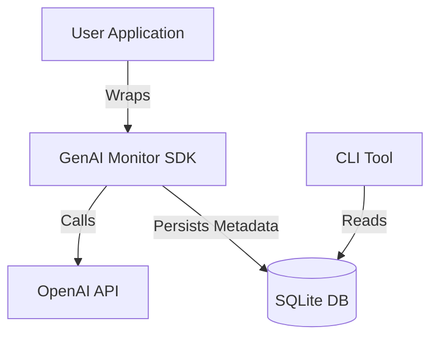

# GenAI API Cost & Drift Monitor

A lightweight, provider-agnostic observability layer for GenAI APIs.

## Why?

GenAI APIs can silently become expensive, slow, or unpredictable as prompts and models change.
This tool helps teams track cost, latency, and prompt drift across GenAI providers.

## What it does

- Captures GenAI usage metrics
- Estimates API cost
- Detects prompt changes via hashing
- Works across providers
- Does not store prompt or response content by default

## What it does NOT do

- Modify or block GenAI calls
- Store sensitive data
- Evaluate output quality

## Architecture

## Roadmap

See [docs/roadmap.md](docs/roadmap.md) for the detailed project roadmap.

## Contributing

Contributions are welcome! Please feel free to submit a Pull Request.
