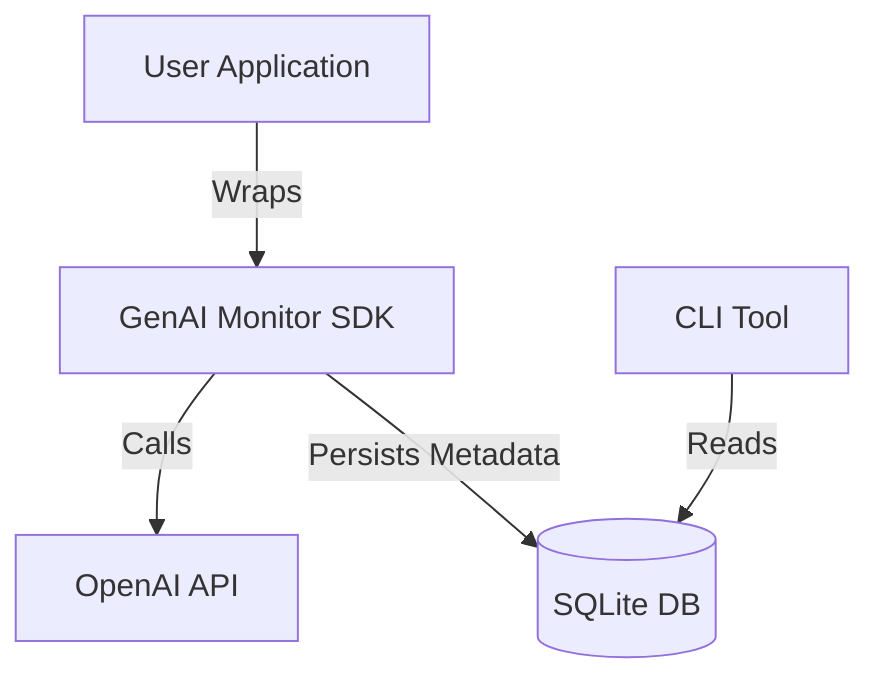

# GenAI API Cost & Drift Monitor

A lightweight, provider-agnostic observability layer for GenAI APIs.

## Why?

GenAI APIs can silently become expensive, slow, or unpredictable as prompts and models change.
This tool helps teams track cost, latency, and prompt drift across GenAI providers.

## What it does

- Captures GenAI usage metrics
- Estimates API cost
- Detects prompt changes via hashing
- Works across providers
- Does not store prompt or response content by default

## What it does NOT do

- Modify or block GenAI calls
- Store sensitive data
- Evaluate output quality

## Architecture


```mermaid
graph TD
    UserApp[User Application] -->|Wraps| MonitorSDK[GenAI Monitor SDK]
    MonitorSDK -->|Calls| OpenAI[OpenAI API]
    MonitorSDK -->|Persists Metadata| SQLite[(SQLite DB)]
    CLI[CLI Tool] -->|Reads| SQLite
```

## Usage

### SDK

```typescript
import { GenAIObservability } from 'genai-observability';
import OpenAI from 'openai';

const obs = new GenAIObservability();
const openai = new OpenAI();

// Wrap the provider to start monitoring
const monitoredOpenAI = obs.monitorProvider(openai);

// Use as normal - cost, latency, and drift are tracked automatically
const response = await monitoredOpenAI.chat.completions.create({
  model: 'gpt-4o',
  messages: [{ role: 'user', content: 'Hello!' }],
});
```

### CLI

Analyze your metrics directly from the terminal using the built-in CLI tool.

```bash
# View usage and cost summary
npx genai-obs usage

# View latency statistics
npx genai-obs latency

# View prompt drift indicators
npx genai-obs drift

# See all available commands
npx genai-obs --help
```

## Roadmap

See [docs/roadmap.md](docs/roadmap.md) for the detailed project roadmap.

## Contributing

Contributions are welcome! Please feel free to submit a Pull Request.
